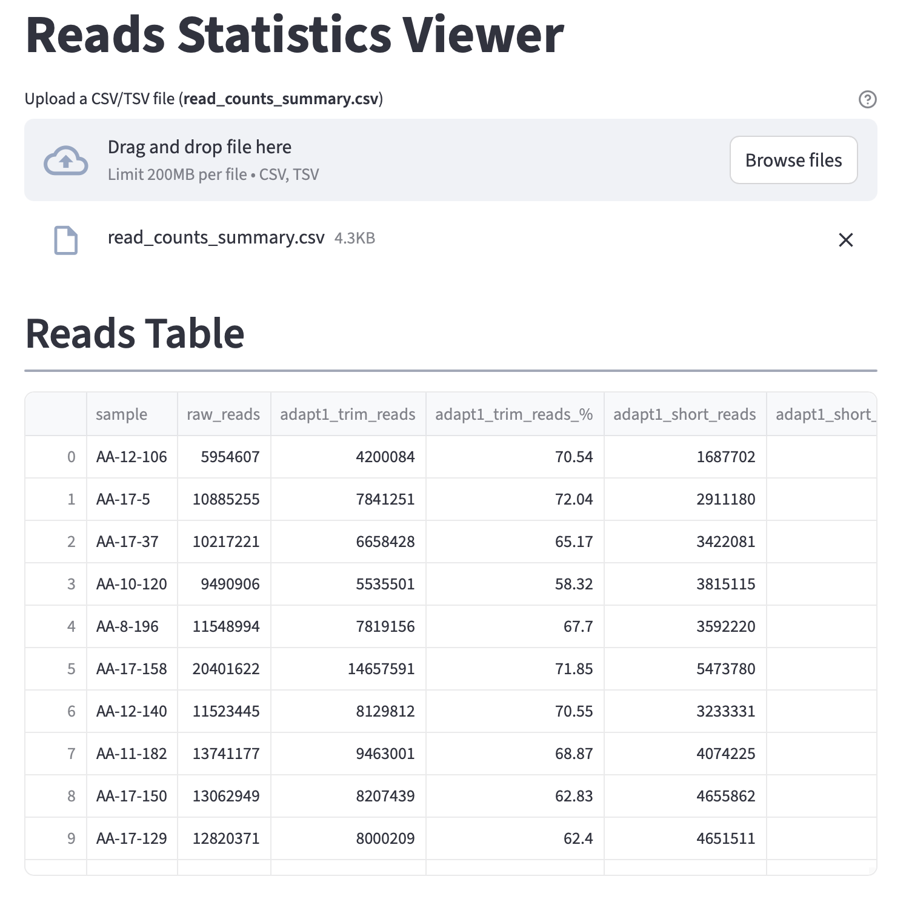
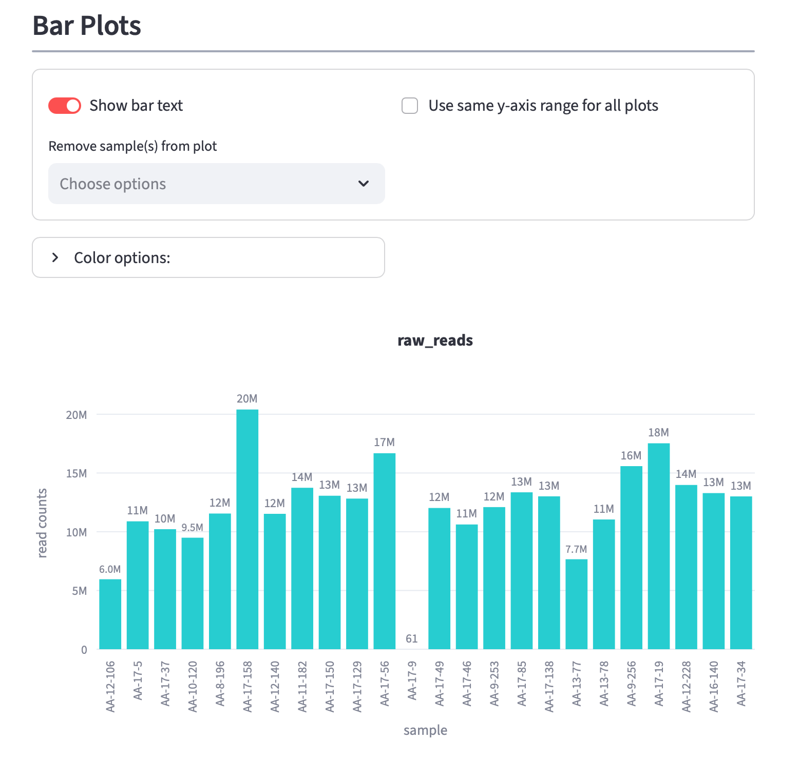
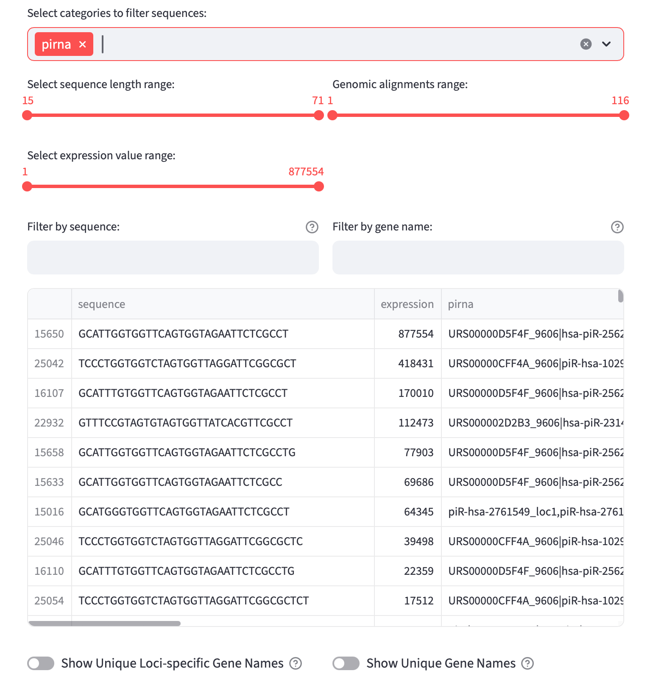
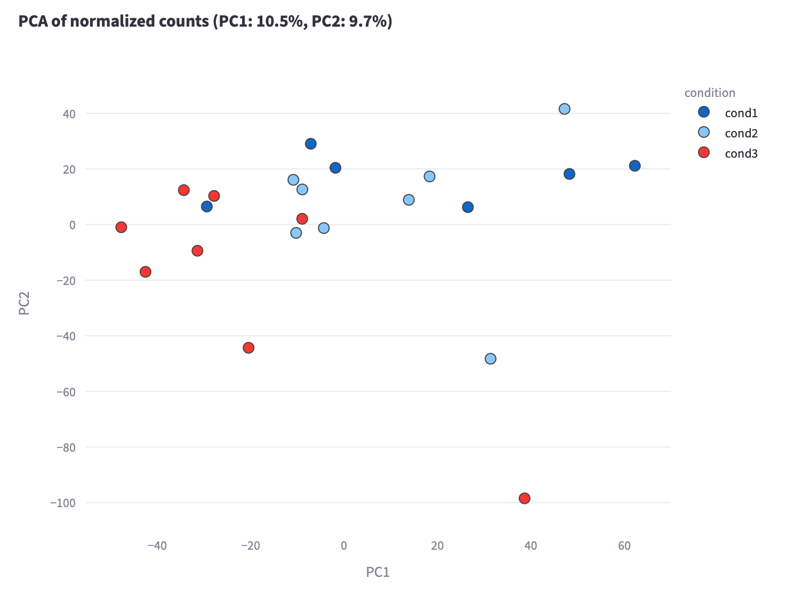
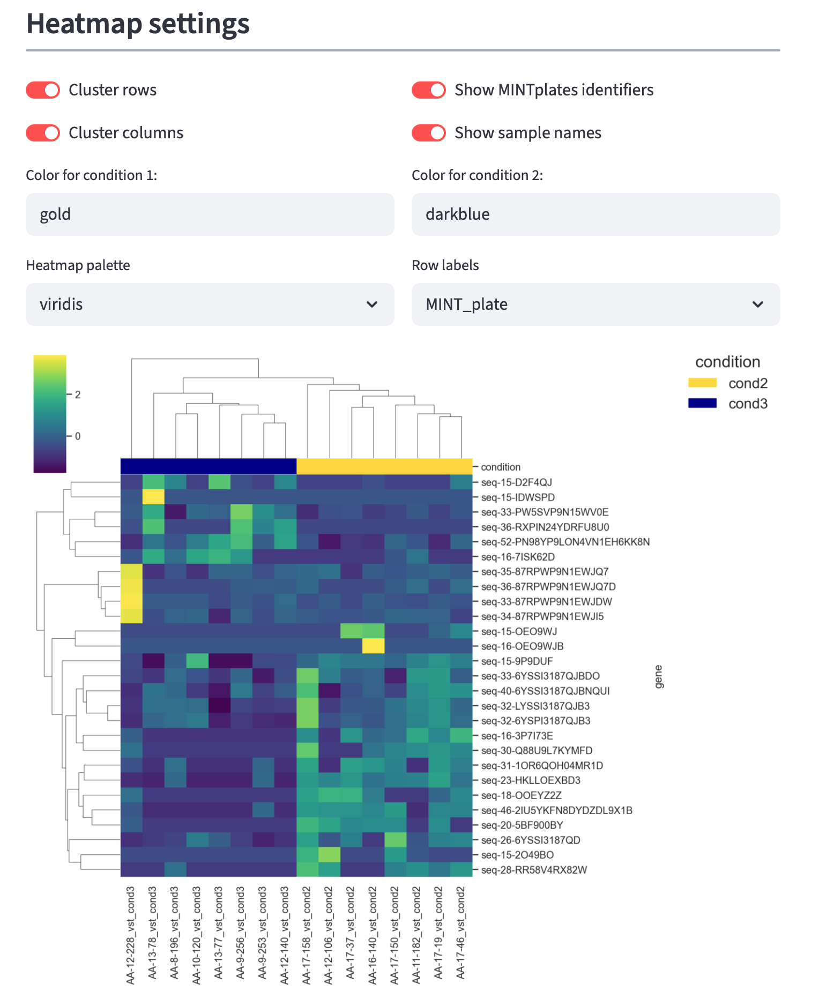
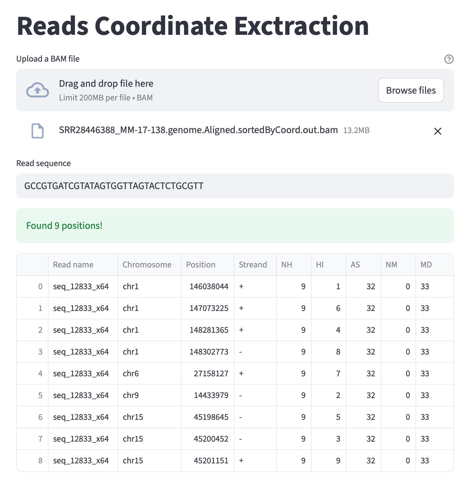
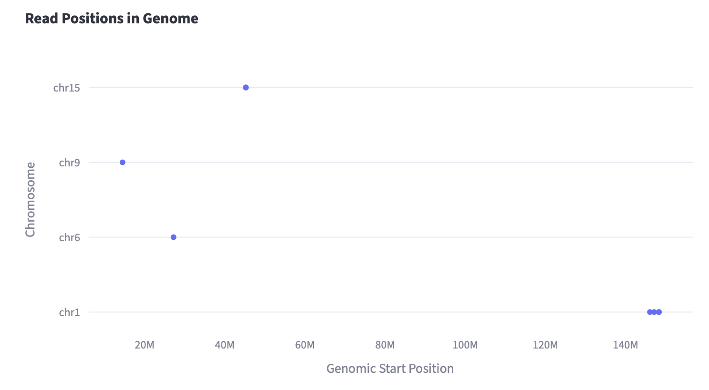

# PerSeqPIPE VIZ Tabs

## Reads Statistics Viewer

### Reads table

Provides visualization of the read counts summary CSV file created by the PerSeqPIPE workflow (`{project_name}/all_stats/read_counts_summary.csv`). This file contains summary for number of reads passing each preprocessing and quantification step. For description of individual columns from the `read_counts_summary.csv` please go to documentation of PerSeqPIPE [here](https://github.com/ktrachtova/perseqpipe/blob/main/docs/outputs.md#reads-statistics).

<picture>
  <source media="(prefers-color-scheme: dark)" srcset="images/reads_statistics_viewer/reads_table.png">
  
</picture>

### Reads Statistics Visualization

Currently 2 different plots to visualize number of reads and percentage of reads passing each preprocessing step are available:

* **barplot** of both number of reads and % passing each preprocessing and quantification step
* **pieplot** showing % of reads in after each preprocessing and quantification step for individual samples

For **barplots**, user can adjust several features such as bar labels, setting identical y-axis range for all plots or changing colors for preprocessing steps. It is also possible to remove specific sample(s) from barplots.

For **pieplots** user can change color palette and remove specific step(s) from the pieplot. To remove specific step just click on it in the pieplot legend and all percentages shown will be automatically adjusted.

<picture>
  <source media="(prefers-color-scheme: dark)" srcset="images/reads_statistics_viewer/barplots.png">
  
</picture>

### Downloading plots

All plots currently viewed (and any adjustments made by user) can be downloaded either individually (top right corner of each plot) or in a batch using buttons at the bottom of the Reads Statistics Viewer section. Currently supported format for batch download of all visualized plots is HTML.

## sncRNA Counts Viewer

This tab supports exploration of sncRNA counts produced by SNCRNA_QUANTICATION module of [PerSeqPIPE](https://github.com/ktrachtova/perseqpipe/blob/main/docs/module_description.md#module-5%EF%B8%8F%E2%83%A3-other-sncrna-quantification) for individual samples and includes following filtering:

* selecting specific sncRNA cathegory
* selecting sequences of specific length
* selecting sequences based on number of genomic alignments
* filtering based on expression
* filtering based on sequence
* filtering based on assigned feature(s)

Additionally, it is possible to obtain list of unique loci-specific gene names as well as list of unique gene names for a set of currently viewed sequences. 

### Loci-specific names

If a specific RNA can be aligned to multiple loci in genome (like many tRNA and piRNA), such gene/transcript name has suffix `_loc{x}` in the custom sncRNA GTF file used for sncRNA quantification by PerSeqPIPE. For more information, please refer to section [sncRNA GTF file format specification](https://github.com/ktrachtova/perseqpipe/blob/main/docs/outputs.md#sncrna-quantification-output-file-format) section of PerSeqPIPE documentation. 

<picture>
  <source media="(prefers-color-scheme: dark)" srcset="images/sncrna_counts_viewer/sncrna_counts_viewer.png">
  
</picture>

## DE Analysis Viewer

The DE Analysis Viewer required following files:

* DE statistics table (`DE_analysis_sncrna_results.tsv` or `DE_analysis_mirna|isomirs_results.tsv` produced by DE_ANALYSIS module of PerSeqPIPE)
* table with counts (`DE_analysis_sncrna_counts.tsv` or `DE_analysis_mirna|isomirs_counts.tsv`).

Please see [PerSeqPIPE documentation](https://github.com/ktrachtova/perseqpipe/blob/main/docs/de_analysis.md#output-files) decribing these specific files and their format.

The DE Analysis Viewer has 2 separate subtabs showing PCA plot and heatmap. 

### PCA plot

PCA plot can be created from **VST** or **DESeq2-normalized counts**. 

<picture>
  <source media="(prefers-color-scheme: dark)" srcset="images/de_analysis_viewer/pca_plot.png">
  
</picture>

### Heatmap

First section **Heatmap sequence selection** allow users to filter genes/sequences for heatmap based on log2FC thresholds, baseMean, p-value and adjusted p-value. User can also switch between different pairwise comparisons (if more than 2 conditions were present inside the design file for DE Analysis) and between different normalization types (raw, VST, DESeq2-normalized).

Sequences selected through **Heatmap sequence selection** section are visualize in the next section **Heatmap visualization**. Here, user can adjust clustering of both rows and columns as well as decide between showing MINTplate identifiers or sequences as row names for heatmap. 

<picture>
  <source media="(prefers-color-scheme: dark)" srcset="images/de_analysis_viewer/heatmap.png">
  
</picture>

## Reads Coordinate Extraction

This tab provides a simple way how to quickly obtain all coordinates of specific quantified sequence. Input is a BAM file generated by PerSeqPIPE workflow (location `{project_name}/rna_quantification/genome/star_genome`) and a specific sequence of interest. Input BAM file will be searched for alignment loci of the specific sequence (on both strands) if there is any. Table summarizing all the found loci as well as a simple scatter plot summarizing on which chromosome can the sequence be found is shown.

<picture>
  <source media="(prefers-color-scheme: dark)" srcset="images/reads_coordinate_extraction/reads_coordinate_extraction.png">
  
</picture>

<picture>
  <source media="(prefers-color-scheme: dark)" srcset="images/reads_coordinate_extraction/chromosome_composition.png">
  
</picture>

### Example usage

Sequence `GCCGTGATCGTATAGTGGTTAGTACTCTGCGTT` was found as the top DE sequence with several annotations including piRNA and tRNA. We want to find out genomic loci for this sequence for a specific sample, because we want to explore how precisely does this sequence overlap each reported annotation.